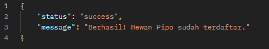
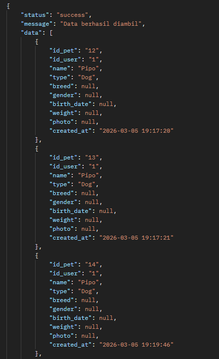
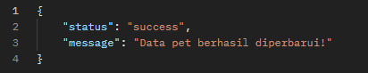
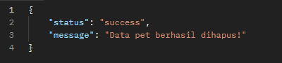

# API Pet Management - Tugas Minggu 3
Proyek ini berisi API CRUD sederhana menggunakan PHP dan MySQL untuk manajemen data hewan peliharaan.

## Fitur API
- **Create**: Menambah data pet baru (`create_pet.php`)
- **Read**: Menampilkan daftar pet (`read_pets.php`)
- **Update**: Mengubah data pet (`update_pet.php`)
- **Delete**: Menghapus data pet (`delete_pet.php`)

## Cara Instalasi
1. Clone repository ini.
2. Import file `database_pet.sql` ke phpMyAdmin.
3. Sesuaikan konfigurasi database di `config.php`.
4. Gunakan Postman untuk melakukan testing endpoint.

## Bukti Testing API (Postman)
Hasil testing API menggunakan Postman (Create):

Hasil testing API menggunakan Postman (Read):

Hasil testing API menggunakan Postman (Update):

Hasil testing API menggunakan Postman (Delete):

